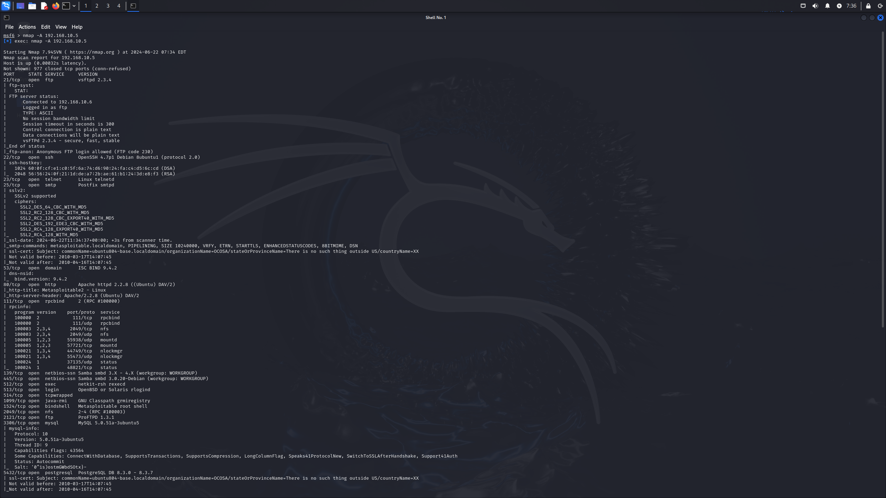
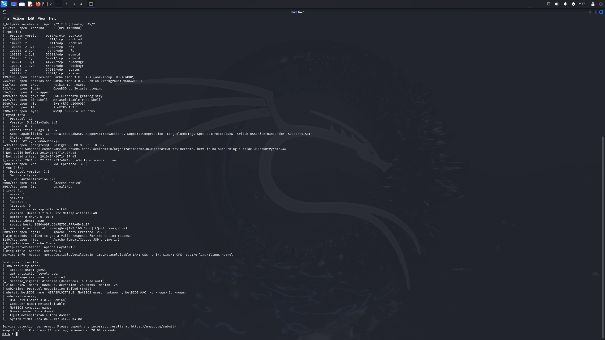
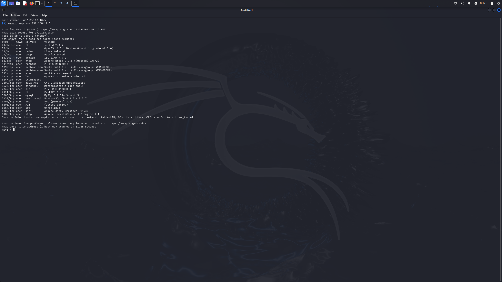
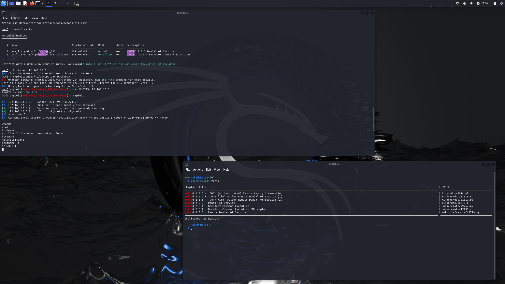
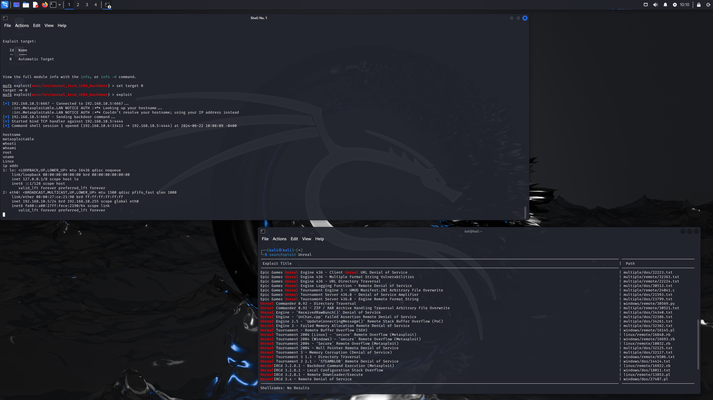
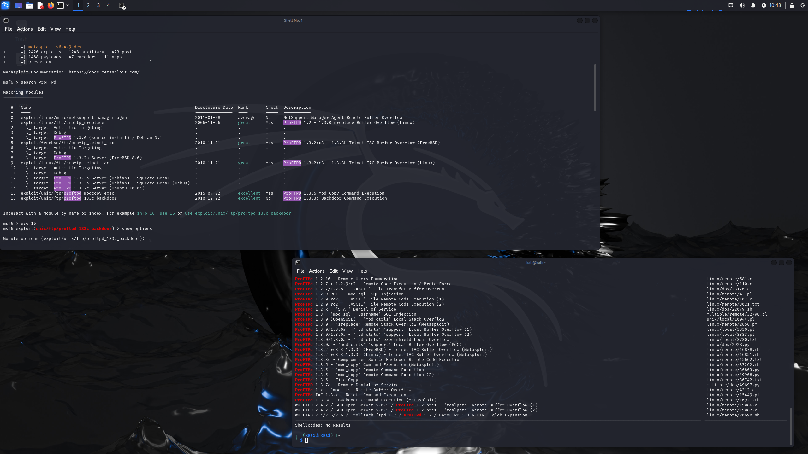
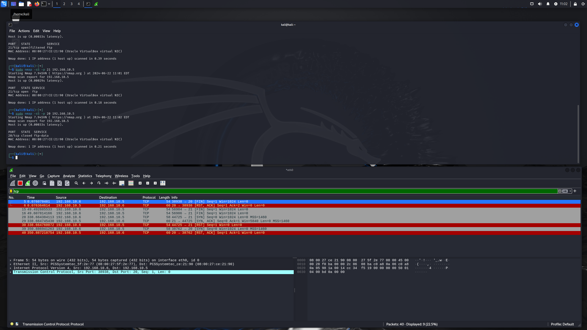
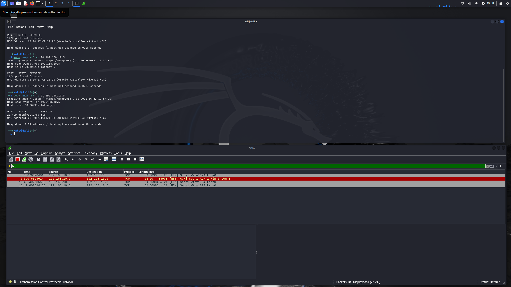
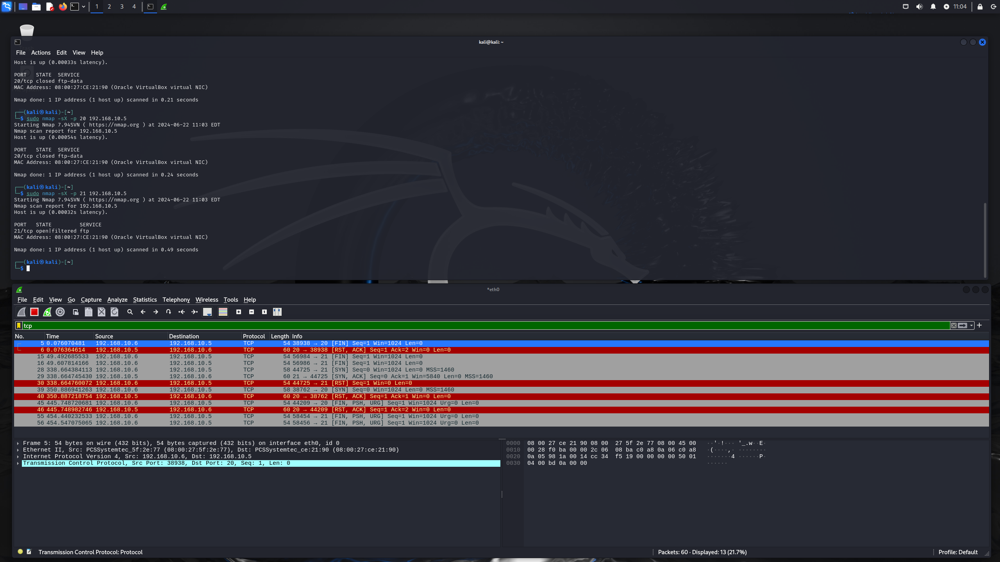
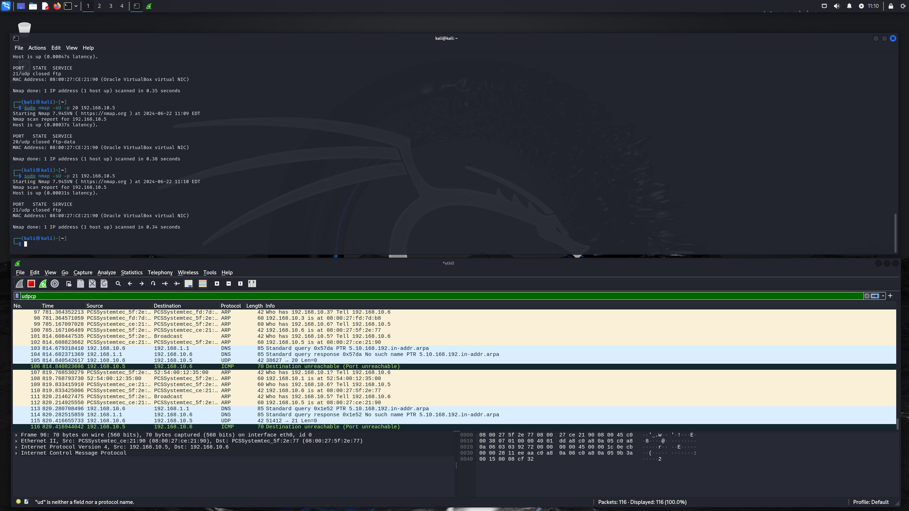

# Домашнее задание к занятию «Уязвимости и атаки на информационные системы» - С. Яремко

### Инструкция по выполнению домашнего задания

1. Сделайте fork [репозитория c шаблоном решения](https://github.com/netology-code/sys-pattern-homework) к себе в Github и переименуйте его по названию или номеру занятия, например, https://github.com/имя-вашего-репозитория/gitlab-hw или https://github.com/имя-вашего-репозитория/8-03-hw).
2. Выполните клонирование этого репозитория к себе на ПК с помощью команды `git clone`.
3. Выполните домашнее задание и заполните у себя локально этот файл README.md:
   - впишите вверху название занятия и ваши фамилию и имя;
   - в каждом задании добавьте решение в требуемом виде: текст/код/скриншоты/ссылка;
   - для корректного добавления скриншотов воспользуйтесь инструкцией [«Как вставить скриншот в шаблон с решением»](https://github.com/netology-code/sys-pattern-homework/blob/main/screen-instruction.md);
   - при оформлении используйте возможности языка разметки md. Коротко об этом можно посмотреть в [инструкции по MarkDown](https://github.com/netology-code/sys-pattern-homework/blob/main/md-instruction.md).
4. После завершения работы над домашним заданием сделайте коммит (`git commit -m "comment"`) и отправьте его на Github (`git push origin`).
5. Для проверки домашнего задания преподавателем в личном кабинете прикрепите и отправьте ссылку на решение в виде md-файла в вашем Github.
6. Любые вопросы задавайте в чате учебной группы и/или в разделе «Вопросы по заданию» в личном кабинете.

Желаем успехов в выполнении домашнего задания.

------

### Задание 1

Скачайте и установите виртуальную машину Metasploitable: https://sourceforge.net/projects/metasploitable/.

Это типовая ОС для экспериментов в области информационной безопасности, с которой следует начать при анализе уязвимостей.

Просканируйте эту виртуальную машину, используя **nmap**.

Попробуйте найти уязвимости, которым подвержена эта виртуальная машина.

Сами уязвимости можно поискать на сайте https://www.exploit-db.com/.

Для этого нужно в поиске ввести название сетевой службы, обнаруженной на атакуемой машине, и выбрать подходящие по версии уязвимости.

Ответьте на следующие вопросы:

- Какие сетевые службы в ней разрешены?
- Какие уязвимости были вами обнаружены? (список со ссылками: достаточно трёх уязвимостей)
  
*Приведите ответ в свободной форме.*  

### Ответ на Задание 1.

Сканируем:

Разрешенные сетевые службы:

Уязвимости:

1. 
2. 
3. 

### Задание 2

Проведите сканирование Metasploitable в режимах SYN, FIN, Xmas, UDP.

Запишите сеансы сканирования в Wireshark.

Ответьте на следующие вопросы:

- Чем отличаются эти режимы сканирования с точки зрения сетевого трафика?
- Как отвечает сервер?

*Приведите ответ в свободной форме.*

### Ответ на Задание 2.

SYN сканирование:

Сканируем 21 порт:

Отправляем TCP пакет с флагом SYN, запрашиваем соединение, в ответ отправляется TCP пакет с флагом ACK, подтверждающий соединение, направляется запрос соединения SYN. На основании этого делаем вывод о том, что порт открыт. Отправляем TCP пакет c флагом RST, прерываем соединение.

Сканируем 20 порт:

Отправляем TCP пакет с флагом SYN, запрашиваем соединение, в ответ отправляет TCP пакет с флагом RST, ACK, прерывающий соединение. Делаем вывод о том, что порт 20 закрыт.

FIN сканирование:

Сканируем 21 порт:

Отправляем TCP пакет с флагом FIN два раза. Отсутствие ответа говорит о том, что порт открыт или фильтруется. Точно определелить открыт он или отфильтрован не возможно, так как порт не отвечает.

Сканируем 20 порт:

Отправляем TCP пакет с флагом FIN. Возвращается TCP пакет с флагом RST, ACK, прерывающий соединение. Делаем вывод о том, что порт 20 закрыт.

Xmas сканирование:

Сканируем 21 порт:

Отправляем TCP пакет с флагом FIN, PSH, URG два раза. Ответ отсутствует - значит порт открыт или фильтруется.

Сканируем 20 порт:

Отправляем TCP пакет с флагом FIN, PSH и URG два раза. В ответ отправляет TCP пакет с флагом RST, ACK, прерывающий соединение. Делаем вывод о том, что порт 20 закрыт.

UDP сканирование:

Сканируем 20 и 21 порты:
Отправляем UDP пакет, в ответ echo ICMP запрос, который означает, что порты недоступены. Порты для соединения по UDP закрыты

